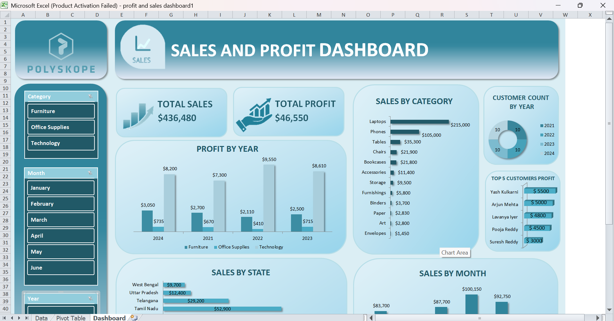
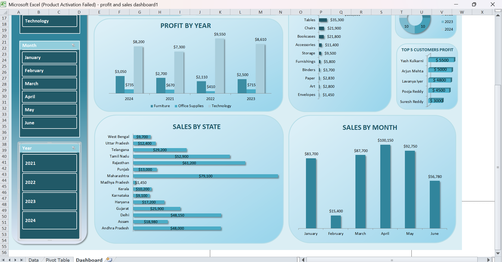

# 📊 Sales and Profit Dashboard (Excel)

Interactive Excel Dashboard analyzing overall sales performance, profit trends, and customer insights.

## 📊 Dashboard Overview

## 📈 Detailed Analysis

## 🔹 Key Metrics
- Total Sales
- Total Profit
- Customer Count by Year

## 🔹 Visual Analysis
- Profit by Year
- Sales by Category
- Sales by State
- Sales by Month
- Top 5 Customers by Profit

## 🔹 Tools Used
- Microsoft Excel
- Pivot Tables
- Pivot Charts
- Slicers
- Conditional Formatting
